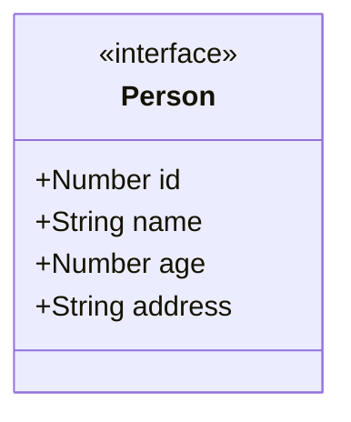

# TypeScript 

## Rappel des intérêts de TS

Le typage statique offre plusieurs avantages :

1. Détection Précoce des Erreurs : Les erreurs de type peuvent être détectées lors de la phase de développement plutôt qu'à l'exécution.

1. Autocomplétion et Documentation : Les éditeurs de texte et les IDE peuvent fournir une meilleure autocomplétion et une documentation plus précise grâce aux informations de type.

1. Meilleure Compréhension du Code : La spécification des types rend le code plus lisible et compréhensible, facilitant la collaboration entre développeurs.

1. Refactoring en Toute Confiance : Les modifications de code peuvent être effectuées en toute confiance, sachant que le compilateur détectera les incompatibilités de type.

## Exemples de typages

```js
// typage simple
let age: number = 25;
let prenom: string = "John";
let pending: boolean;

// typage tableau 
let nombres: number[] = [1, 2, 3, 4];
let noms: string[] = ["Alice", "Bob", "Charlie"];

// typage de tuple
let person: [string, number] = ["John", 30];

// typage enum
enum Days {
  Lundi,
  Mardi,
  Mercredi,
  Jeudi,
  Vendredi,
  Samedi,
  Dimanche,
}

let day: Days = day.Lundi;

```

Le typage particulier any existe mais on perd l'avantage du typage

```js
let value: any = "Hello";
value = 42; // Pas d'erreur, mais perd les avantages du typage

```

Les fonctions se typent également.

>[!NOTE]
>Le typage optionnel existe et se définit avec un ? à la fin de la variable.

```js
// typage et typage optionnel
function sayHello(name: string, age?: number): void {
  if (age) {
    console.log(`Bonjour, ${name}! Tu as ${age} ans.`);
  } else {
    console.log(`Bonjour, ${name}!`);
  }
}

direBonjour("Alice");
direBonjour("Bob", 30);

```

## Typage d'interface

Les interfaces en TypeScript permettent de définir la forme des objets en spécifiant les types de leurs propriétés. 

Elles sont largement utilisées pour déclarer des contrats que les objets doivent respecter.

```js
interface Person {
  name: string;
  age: number;
  address?: string; // Propriété optionnelle
}

let user: Person = {
  name: "Alice",
  age: 28,
};

```

## Type

En TypeScript, le mot-clé type est utilisé pour définir des alias de types. Ils permettent de faire de l'abstraction de type

```js
// type simple
type ID = number;
type Username = string;
type Status = "active" | "inactive";


// type complexe
type User = {
    id: ID;
    username: Username;
    status: Status;
};

// typage générique nous allons le voir plus loing
type Pair<T> = [T, T];

// utilisation
function getUserById(id: ID): User {
    // Implémentation de la fonction pour récupérer un utilisateur par son identifiant
}

function processPair(pair: Pair<number>): number {
    // Implémentation de la fonction pour traiter un tuple de nombres
}

// typage de fonction
type MiddlewareFunction = (context: any, next: () => void) => void;
```

## Exercice Gestion d'un tableau d'utilisateurs

Vous travaillez sur une application de gestion d'utilisateurs en TypeScript. Vous avez la tâche de créer une fonction qui permet d'ajouter des utilisateurs à un tableau tout en vérifiant si la personne existe déjà dans le tableau.

Les features 

1. Créez un dossier Users un dossier types.
1. Créez un fichier TypeScript nommé `Container.ts`.
1. Définissez les types `Person` (voir le modèle UML ci-après) et `ErrorPerson` dans un fichier séparé `types.ts` ou un dossier types en spécifiant chaque type dans des fichiers séparés.
1. Implémentez la fonction `Container` dans `Container.ts` qui retourne une fonction `addUser`.
1. La fonction `addUser` prend un paramètre `user` de type `Person` et doit ajouter cet utilisateur au tableau `users` s'il n'existe pas déjà.
1. Si l'utilisateur existe déjà, lancez une erreur avec le code `100` et le message "The person already exists in the users array.".
1. Retournez le tableau mis à jour s'il n'y a pas d'erreur.

1. Modèle Person



**Exemple d'utilisation :**

```js

import { Person } from './Model/Users/types/Person';
import { ErrorPerson } from './Model/Users/types/Error';
import { container } from './Model/Users/Container';

const addUser = container();

try {
    const user1: Person = { id: 1, name: "John Doe" };
    const user2: Person = { id: 2, name: "Jane Doe" };

    console.log(addUser(user1)); // [ { id: 1, name: 'John Doe' } ]
    console.log(addUser(user2)); // [ { id: 1, name: 'John Doe' }, { id: 2, name: 'Jane Doe' } ]

    // Tentative d'ajout d'un utilisateur déjà existant
    console.log(addUser(user1)); // Error: { code: 100, message: 'The person already exists in the users array.' }
} catch (error) {
    if( error instanceof ErrorPerson )
        console.error(error);
}
```

## Type générique

Les types génériques en TypeScript permettent de créer des composants réutilisables et flexibles en introduisant la notion de paramètres de type. 

### Exemple et syntaxe

Dans cet exemple, T (arbitraire) est un paramètre de type qui est spécifié lors de l'appel de la fonction identity.

```js
function identity<T>(arg: T): T {
    return arg;
}

let result = identity<string>("Hello, World!");
console.log(result);
```

