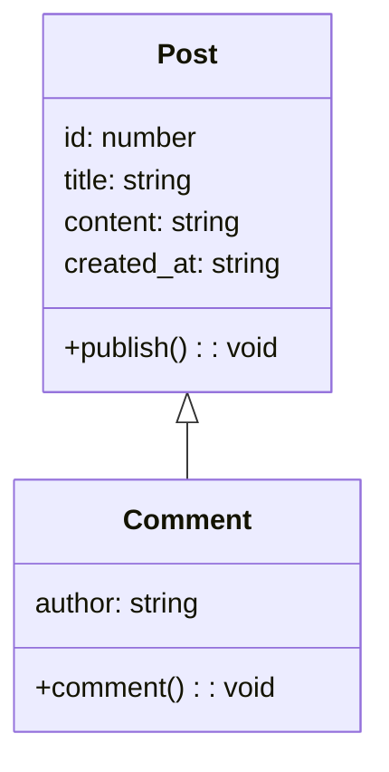

# Introduction à la POO 
# Sommaire

1. Introduction à la POO
   - Motivation
   - Concepts fondamentaux de la POO
   
2. L'encapsulation
   - Exemple avec une classe Duck
   - Exercice getter et setter
   
3. Héritage
   - Exemple d'héritage entre Post et Comment
   - Code en TypeScript
   
4. Polymorphisme
   - Exemple avec les classes Geometry et Square
   
5. Les Interfaces en TypeScript
   - Déclaration d'une Interface
   - Implémentation avec la classe Circle
   - Interface dans le polymorphisme
   - Exercice formes géométriques
   - Interface segregation ISP
   
6. Classe abstraite
   - Déclaration d'une Classe Abstraite
   - Exemple avec la classe Shape
   - Utilisation des classes dérivées

## Motivation

La programmation orienté objet permet :

**Réutilisation de code** : Les classes et les objets permettent de réutiliser du code de manière efficace. Vous pouvez créer de nouvelles classes en réutilisant des classes existantes.

**Modularité** : La POO favorise la modularité en divisant le code en classes et en permettant la création de modules réutilisables.

**Compréhension du code** : La POO rend le code plus lisible et compréhensible en organisant la logique du programme de manière structurée.

## Concepts fondamentaux de la POO

:rocket:

**Objet** : En programmation orientée objet, un objet est une instance d'une classe. Une classe est un modèle qui définit les propriétés et les méthodes que les objets peuvent avoir.

>[!TIP]
> Une classe étant un modèle vous pouvez à partir de celle-ci avoir plusieurs objets.

**Classe** : Une classe est un plan ou un modèle pour créer des objets. Elle définit les propriétés et les méthodes que les objets auront.

## L'encapsulation

L'encapsulation consiste à regrouper les données et les méthodes qui agissent sur ces données dans une seule unité. 
L'encapsulation est un principe de la programmation orientée objet visant à restreindre l'accès aux détails internes d'un objet et à protéger ses états. 

Cela implique de masquer les détails d'implémentation et de rendre certaines variables ou méthodes privées.

```js
class Duck {
  private name: string;

  constructor(name: string) {
    this.name = name;
  }

  sayHello() : string {
    return `Hello, my name is ${this.name}.`;
  }
}


const duck = new Duck("John");
duck.sayHello(); 
```

La propriété `duck.name` est inaccessible à l'extérieur de la classe.

## Exercice getter et setter

En utilisant les getter et setter classique en JS implémentez les dans la classe Duck.

## Héritage

L'héritage permet la spécialisation, définir une classe plus spécifique. La sous-classe hérite alors des caractéristiques d'une classe plus générale. La sous-classe est une version spécialisée d'une classe mère, elle peut avoir des attributs ou des méthodes supplémentaires.

### Exemple d'héritage entre Post et Comment



Le code en TypeScript donnerait 

```js
// Base class for posts
class Post {
  private id: number;
  private title: string;
  private content: string;
  private created_at: string;

  constructor(id: number, title: string, content: string) {
    this.id = id;
    this.title = title;
    this.content = content;
    this.created_at = new Date();
  }

 // setter and getter ...
}

// Subclass: Comment
class Comment extends Post {
  private author: string;

  constructor(id: number, title: string, content: string, author: string) {
    super(id, title, content);
    this.author = author;
  }

  // getter and setter
}

// Using the classes
const post = new Post(1, "Introduction to TypeScript", "A guide on TypeScript.");
const comment = new Comment(1001, "Great article!", "I really enjoyed reading it.", "Alice");
```

>[!NOTE]
> En programmation orientée objet, lorsque la classe B hérite de la classe A, elle doit respecter le principe du "est-un" (`is-a` en anglais). En d'autres termes, la classe B est une spécialisation de la classe A, et elle partage ses caractéristiques et son comportement.
> Par exemple, un commentaire est une forme spécifique de post. Si ce principe n'est pas respecté, cela compromet le sens de l'héritage et la logique de la conception orientée objet.

## Polymorphisme


>[!WARNING]
> En TypeScript l'héritage multiple n'existe pas.

L'utilisation de l'héritage de classes et de l'implémentation d'interfaces permet d'obtenir une certaine forme de polymorphisme. L'héritage permet aux classes de partager et de substituer des comportements, tandis que les interfaces (que nous verrons plus loin) fournissent une manière de définir des contrats communs que plusieurs classes peuvent mettre en œuvre.


```js

class Geometry  {
  draw(): string {
    return "Drawing a geometry..." ;
  }
}

class Square extends Geometry {
  draw(): string {
    return "Drawing a square...";
  }
}

const square: Geometry = new Square();
square.draw(); 

```

## Les Interfaces en TypeScript

Elles fournissent un moyen de définir des contrats, décrivant la structure que les classes doivent suivre. 

>[!IMPORTANT]
>En d'autres termes, les interfaces définissent un ensemble de propriétés et de méthodes que les classes qui les implémentent doivent **obligatoirement** fournir.

### Déclaration d'une Interface

- mot clé interface

```js
interface Shape {
  draw(): void;
  perimeter(): number;
}
```

Implémenation, une classe peut implémenter une à plusieurs interfaces.

```js

class Circle implements Shape {
  private radius: number;

  constructor(radius: number) {
    this.radius = radius;
  }

  draw(): void {
    console.log("Drawing a circle.");
  }

  perimeter(): number {
    return 2 * Math.PI * this.radius;
  }
}

```

### Interface dans le polymorphisme

Les interfaces facilitent le polymorphisme en permettant à des objets de différentes classes de partager un contrat commun.


### Exercice formes géométriques

Supposons que vous ayez des formes géométriques comme des cercles et des carrés. Utilisez une interface pour définir un contrat commun pour ces formes.

### Interface segregation ISP

Le principe de ségrégation d'interface (ISP) stipule qu'une classe ne devrait pas être forcée de dépendre d'interfaces qu'elle n'utilise pas. 

En d'autres termes, il est préférable d'avoir plusieurs interfaces spécifiques qu'une seule interface globale.

### Classe abstraite

Elles permettent de définir des classes avec des méthodes et des propriétés, tout en imposant aux classes dérivées de fournir une implémentation pour certaines parties de la classe. 

En TypeScript, les classes abstraites sont déclarées avec le mot-clé `abstract`.

>[!IMPORTANT]
> Une classe abstraite ne peux être instanciée (comme une interface), mais vous ne pouvez pas hériter de plusieurs classes en même temps.

```js
abstract class Shape {
  private color: string; // Propriété concrète

  constructor(color: string) {
    this.color = color;
  }

  abstract draw(): void; // Méthode abstraite

  // Méthode concrète
  getColor(): string {
    return this.color;
  }
}
```

Les classes dérivées d'une classe abstraite doivent implémenter toutes les méthodes abstraites définies dans la classe parente. 

## Atttributs statiques 

Les attributs statiques sont des propriétés de classe partagées par toutes les instances de cette classe. 

Ils sont déclarés en utilisant le mot-clé **static**. Voici un exemple en TypeScript, notez que vous ne pouvez pas accèder aux variables statiques d'une classe depuis l'objet dans le script courant comme en PHP par exemple avec l'opérateur de résolution `::` .

```js
class C {
    public static PI: number = 3.14159;

    perimeter(radius: number): number {
        return 2 * C.PI * radius;
    }
}

// change la valeur pour toutes les instances de classe
C.PI = Math.PI;
const a = new C()
const b = new C()
console.log(a.perimeter(10))
```

Pour les méthodes on ne peut pas faire référence au mot clé `this` , car la méthode est associée à la classe elle-même.